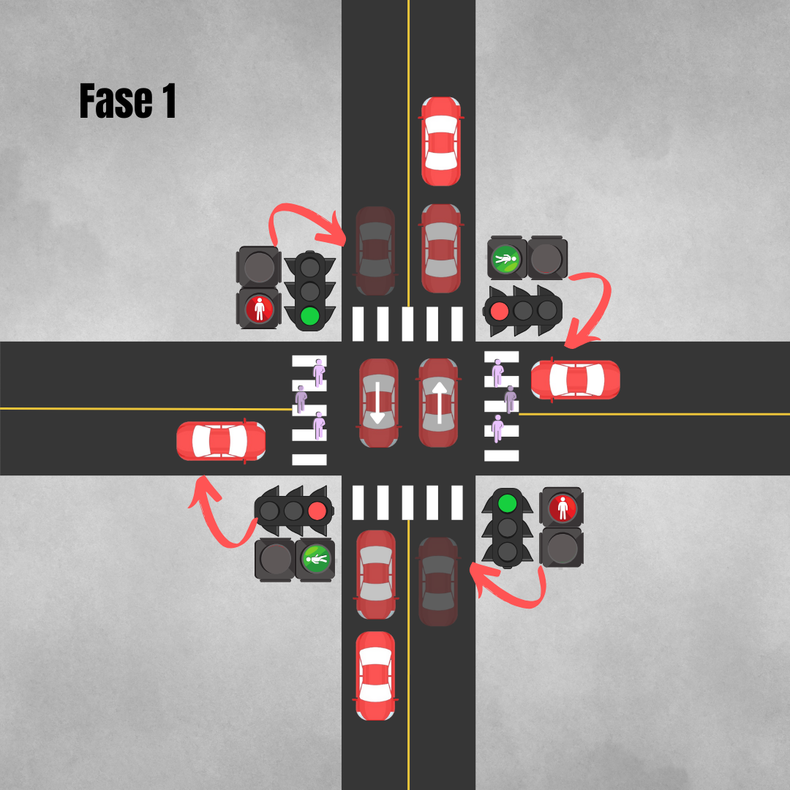
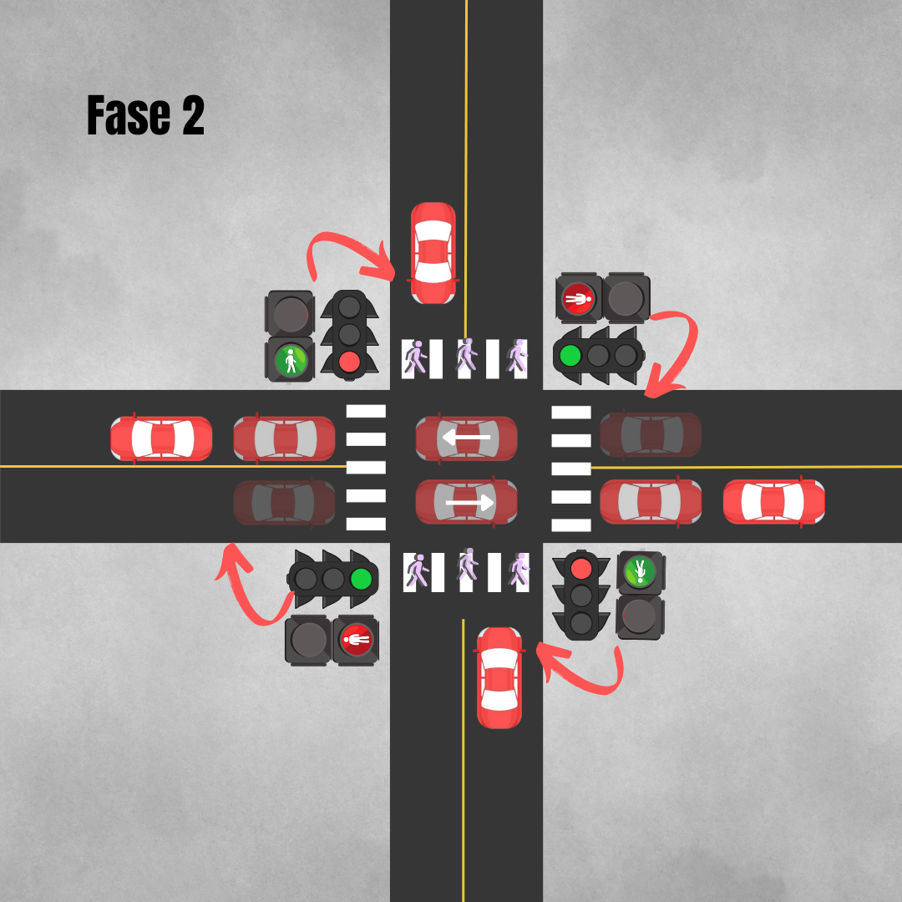
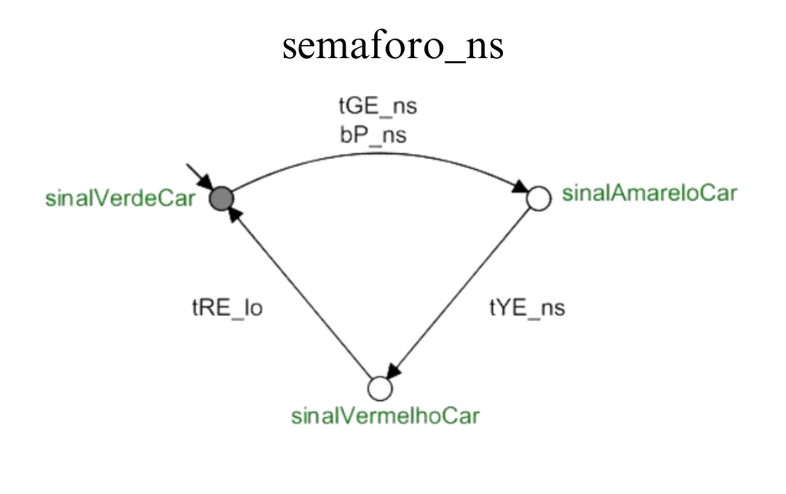
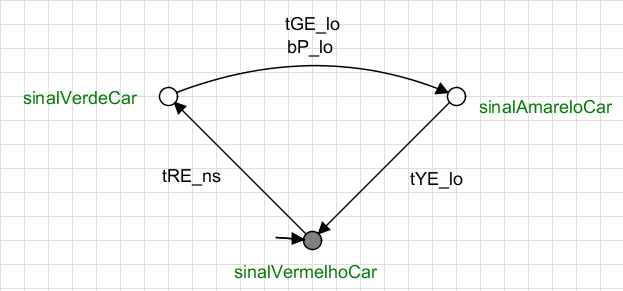
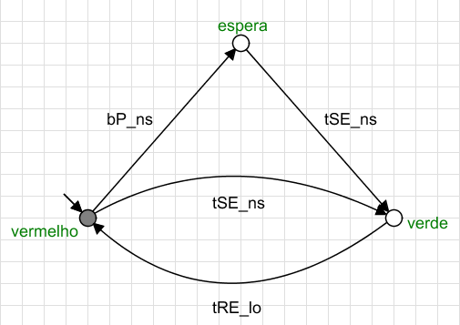
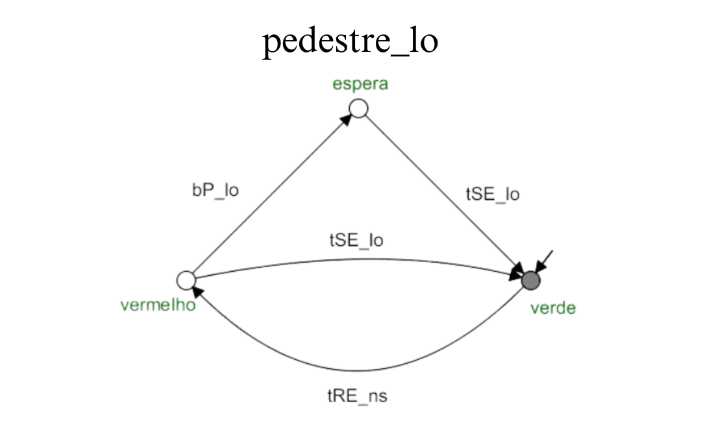
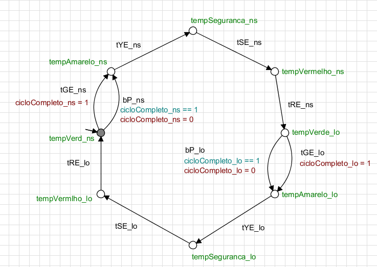
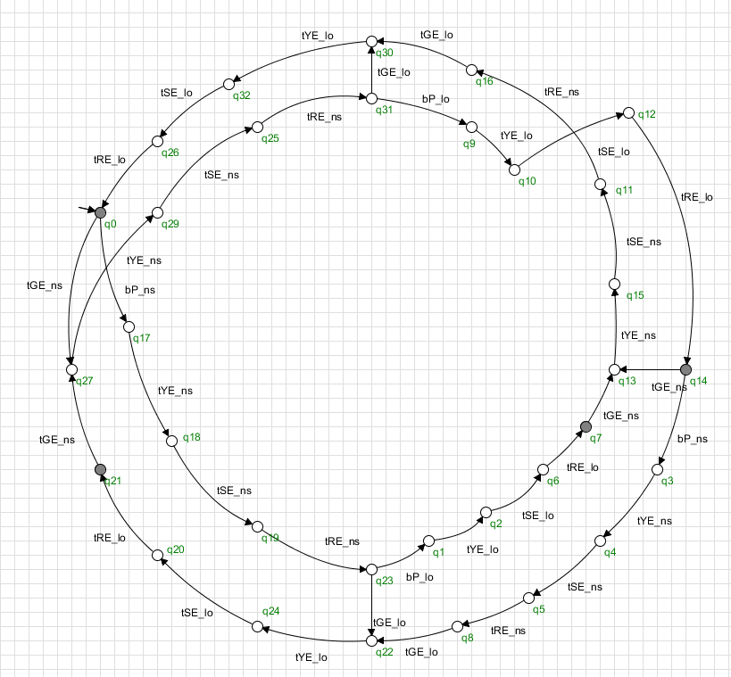

# Sistema de controle de tráfego para um cruzamento de quatro vias utilizando a ferramenta Supremica

## Descrição

Neste projeto, foi modelado um sistema de controle de tráfego em um cruzamento, composto por semáforos de tráfego de veículos e semáforos de trafego de pedestres. O objetivo principal é sincronizar os sinais levando em consideração a segurança dos usuários das vias e evitar congestionamentos.

### Contexto

Foi utilizado o seguinte contexto de controle do cruzamento:
| Fase | Semáforo para Veículos | Movimentos Permitidos para Veículos | Semáforo para Pedestres | Movimentos Permitidos para Pedestres |
| ---- | ----------------------- | ---------------------------------- | ----------------------- | ---------------------------------- |
| 1    | Norte🔁Sul   🟢 Leste🔁Oeste 🔴 | Direto ⬆️⬇️ | Leste 🔁 Oeste 🟢 | Atravessar: Leste 🔁 Oeste |
| 2    | Leste🔁Oeste 🟢 Norte🔁Sul   🔴 | Direto ➡️⬅️ | Norte 🔁 Sul   🟢 | Atravessar: Norte 🔁 Sul |

A configuração descrita na tabela anterior pode ser melhor observada nas imagens a seguir.

  
   

## Componentes do Sistema

1. **Semáforos para tráfego veículos (2x):**  Um semáforo controla a via Norte-Sul e o outro semáforo controla o tráfego na via Leste-Oeste.
2. **Semáforos para tráfego de pedestres (2x):** Um semáforo controla a via Norte-Sul e o outro semáforo controla o tráfego de pedestres na via Leste-Oeste.
3. **Temporizador (1x):** Controla o tempo em que cada semáforo pode permanecer ativo.

## Eventos Controláveis

1. **Mudança de estado dos semáforos para veículos:** O ato de alterar a luz de um semáforo de verde para amarelo, de amarelo para vermelho, ou de vermelho para verde. O controle destas transições é essencial para gerenciar o fluxo de tráfego.
2. **Ativação/desativação dos semáforos para pedestres:** similarmente aos semáforos para veículos, a possibilidade de ativar ou desativar os semáforos para pedestres conforme necessário para garantir sua segurança ao atravessar as vias.
3. **Ajuste de temporizadores dos semáforos**: a capacidade de ajustar dinamicamente os temporizadores dos semáforos com base nas condições atuais de tráfego, visando a otimização do fluxo e a redução de congestionamentos.

## Eventos não controláveis

1. **Pressão do botão de pedestre:** A ação de um pedestre pressionando o botão para solicitar a travessia.

## Estratégias de controle utilizadas

1. **Gerenciamento de prioridades no fluxo de carros:**  Quando um pedestre solicita atravessar, sua prioridade é garantida. Após o fechamento do sinal para pedestres, a solicitação será atendida novamente somente no após a finalização do próximo ciclo normal do semáforo para veículos (verde-amarelo-vermelho), minimizando congestionamentos.

## Modelo

Para modelar e controlar o tráfego no cruzamento, foram utilizados seis autômatos finitos, incluindo um autômato supervisor.

A seguir serão descritos os comportamentos dos autômatos dos semáforos do tráfego de carros e de pedestres que controlam a via Norte-Sul. Para o autômato da via Leste-Oeste, pode-se realizar uma análise semelhante, uma vez que os dois sinais são idênticos, diferindo apenas nos sufixos dos eventos associados. Eventos relacionados ao semáforo Norte-Sul são identificados pelo sufixo "ns", enquanto para eventos relacionados ao semáforo Leste-Oeste, o sufixo utilizado é "lo".

### **Autômatos de Semáforos para tráfego de veículos**

1. **semaforo_ns:** Modela o controle de semáforos para o tráfego Norte-Sul.
2. **semaforo_lo**: Modela o controle de semáforos para o tráfego Leste-Oeste.

  
   

- **Estados**

| **Estado**  | **Descrição** |
| --- | --- |
| sinalVerdeCar (Estado Inicial) | Indica que o sinal está verde para o tráfego Norte-Sul. |
| sinalAmareloCar | Indica que o sinal está amarelo para o tráfego Norte-Sul. |
| sinalVermelhoCar | Indica que o sinal está vermelho para o tráfego Norte-Sul. |

- **Eventos**

| Evento | Descrição |
| --- | --- |
| tGE_ns | Indica que o tempo em que o sinal Norte-Sul pode permanecer verde expirou |
| tYE_ns | Indica que o tempo em que o sinal Norte-Sul pode permanecer amarelo expirou |
| tRE_lo | Indica que o tempo em que o sinal Leste-Oeste pode permanecer vermelho expirou |
| bP_ns | Indica que um pedestre apertou o botão solicitando atravessar a via Norte-Sul e este é um evento não-controlado. |

**Comportamento Esperado**

- Quando o semáforo está em **sinalVerdeCar**, o tráfego **Norte-Sul** pode fluir.
- Quando ocorre **tGE_ns** ou **bP_ns** o sinal verde teve o tempo de ativação expirado e o sinal amarelo pode ocorrer.
- Quando o semáforo está em **sinalAmareloCar**, o tráfego **Norte-Sul** deve parar em preparação para o vermelho.
- Quando ocorre **tYE_ns** o sinal amarelo teve o tempo de ativação expirado e o sinal vermelho pode ocorrer.
- Quando o semáforo está em **sinalVermelhoCar**, o tráfego **Norte-Sul** está parado.
- Quando ocorre **tRE_lo** o sinal vermelho da via **Leste-Oeste** o **sinalVerdeCar** pode ocorrer novamente evitando que os dois sinais fiquem verdes ao mesmo tempo.

- ### **Autômatos de Semáforos para tráfego de pedestres**

1. **pedestre_ns:** Modela o controle de semáforos para o tráfego de pedestres Norte-Sul.
2. **pedestre_lo**: Modela o controle de semáforos para o tráfego de pedestres Leste-Oeste.

  
   

- **Estados**

| Estado  | Descrição |
| --- | --- |
| Vermelho(Estado Inicial) | Indica que o sinal está vermelho para os pedestres da via Norte-Sul. |
| Espera | Indica que há pedestres aguardando para atravessar a via Norte-Sul |
| Verde | Indica que o sinal está verde para os pedestres da via Norte-Sul. |
- **Eventos**

| Evento | Descrição |
| --- | --- |
| tSE_ns | Indica que o tempo de segurança do semáforo Norte-Sul expirou |
| tRE_lo | Indica que o tempo em que o sinal Leste-Oeste pode permanecer vermelho expirou |
| bP_ns | Indica que um pedestre apertou o botão solicitando atravessar a via Norte-Sul e este é um evento não-controlado. |

### **Autômato Temporizador**

- **temporizador**: Este autômato é do tipo planta e simula o controle de tempo em que cada estado dos semáforos pode permanecer ativo.

**Comportamento Esperado**

- Enquanto o semáforo de carros estiver verde o sinal de pedestres permanece no sinal **vermelho**.
- Quando ocorre o **tSE_ns** significa que o sinal de carros está vermelho portanto os pedestres da via podem atravessar.
- Quando ocorre **tRE_lo** o semáforo de carro está prestes a ficar verde novamente, logo o sinal de pedestres deve ser fechado.
- Quando ocorre **bP_ns**, o pedestre vai para um estado de espera até que seja seguro atravessar novamente.

  
   
  Autômato Temporizador

- **Estados**

| Estado | Descrição |
| --- | --- |
| tempVerd_ns(Estado Inicial) | Indica que o sinal está verde para o trafégo de carros da via Norte-Sul. |
| tempAmarelo_ns | Indica que o sinal está amarelo para o trafégo de carros da via Norte-Sul. |
| tempSeguranca_ns | Indica que o sinal está prestes a ficar vermelho para o trafégo de carros da via Norte-Sul. |
| tempVermelho_ns | Indica que o sinal está vermelho para o trafégo de carros da via Norte-Sul. |

A mesma descrição dos estados terminados em “lo” pode ser feita de acordo com a tabela acima.

**Comportamento Esperado**

- Cada sinal completa um ciclo (verde-amarelo-vermelho) sem que ocorram estados conflitantes, como os dois sinais ficarem verdes ao mesmo tempo.
- Neste autômato utilizamos duas variáveis cicloCompleto_ns e cicloCompleto_lo que capturam quando um pedestre solicita o acesso a via e garante que entre uma solicitação e outra um ciclo do semáforo do tráfego de carros possa ocorrer de forma que sejam evitados congestionamentos.

### **Autômato Supervisor**

Com uma combinação dos autômatos descritos anteriormente o autômato para esse supervisor foi gerado.

  
   
  Autômato Supervisor

No analyzer, podemos identificar que o supervisor possui 32 estados.

  
   
  Analyzer

### Condições finais do projeto

Com os testes de verificação do Supremica, ficou confirmado que:

1. O Sistema é **não bloqueante.**
2. O Sistema é **controlável.**
3. O Sistema é **livre de deadlock.**

## Considerações

Este projeto permitiu abordar conhecimentos práticos do uso de autômatos e da ferramenta Supremica em um contexto real de uso. A utilização de autômatos finitos para gerenciar o tráfego em um cruzamento demonstra ser uma abordagem útil para aprofundar nossos conhecimentos. Ao atribuir funções específicas a cada autômato, como o controle dos semáforos e das faixas de pedestres, conseguimos coordenar de maneira eficiente o fluxo de veículos e pedestres. Além disso, a introdução de variáveis  oferece uma resposta adaptativa às condições em tempo real, mitigando congestionamentos e promovendo uma circulação mais fluída nas vias além de utilizar mais um recurso do Supremica.

