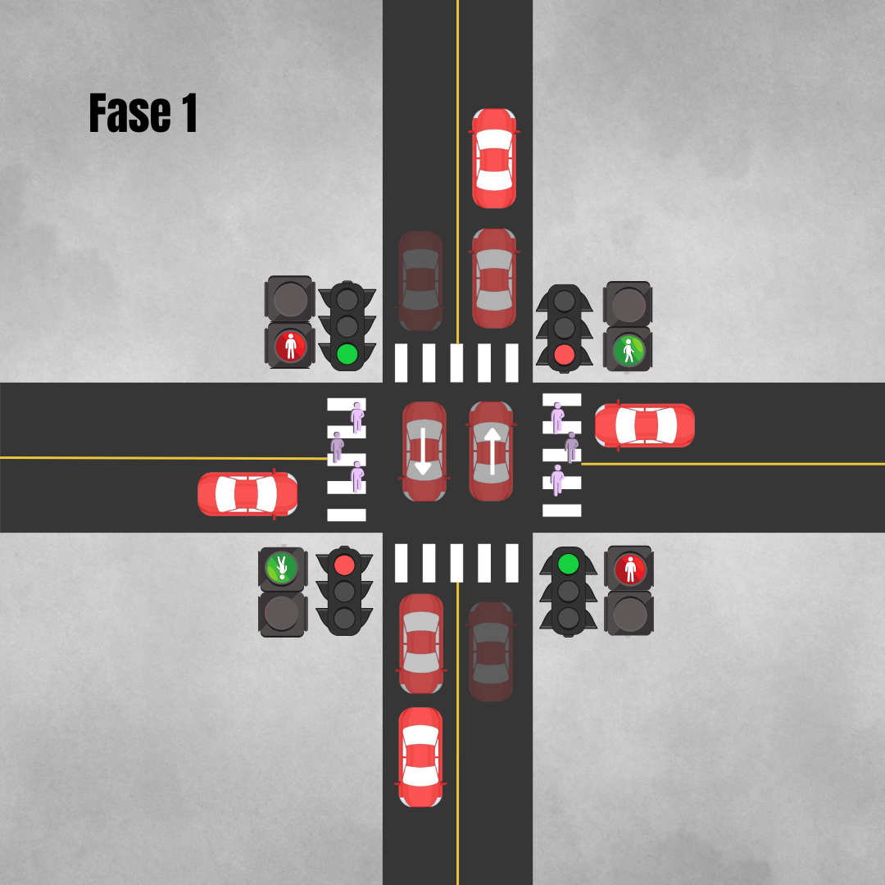

# Sistema de controle de tráfego para um cruzamento de quatro vias utilizando a ferramenta Supremica
Este projeto aborda a necessidade de desenvolver um sistema de controle de tráfego eficiente para cruzamentos de quatro vias. Em áreas urbanas e suburbanas, cruzamentos deste tipo representam pontos críticos de interseção onde a gestão adequada do tráfego é vital para a segurança viária e a fluidez do tráfego. No entanto, esses cruzamentos enfrentam desafios específicos que podem resultar em congestionamentos, atrasos e, o mais importante, riscos à segurança dos usuários da via.

## Objetivos

- Desenvolver um sistema de controle de tráfego eficiente que gerencie o fluxo de veículos e pedestres em um cruzamento de quatro vias, minimizando o tempo de espera e evitando congestionamentos;
- Garantir a segurança de todos os usuários da via, incluindo veículos e pedestres.

## Requisitos

- O sistema deve controlar semáforos para veículos e pedestres em todas as quatro vias;
- Deve haver uma lógica de controle que priorize a segurança e a eficiência, evitando colisões e minimizando o tempo de espera;
- O sistema deve ser capaz de adaptar-se a diferentes fluxos de tráfego, considerando horários de pico.

Neste cenário, o modelo que utilizamos de controle de cruzamento utiliza a seguinte configuração:
| Fase | Semáforo para Veículos | Movimentos Permitidos para Veículos | Semáforo para Pedestres | Movimentos Permitidos para Pedestres |
| ---- | ----------------------- | ---------------------------------- | ----------------------- | ---------------------------------- |
| 1    | Norte🔁Sul   🟢 Leste🔁Oeste 🔴 | Direto ⬆️⬇️ | Leste 🔁 Oeste 🟢 | Atravessar: Leste 🔁 Oeste |
| 2    | Leste🔁Oeste 🟢 Norte🔁Sul   🔴 | Direto ➡️⬅️ | Norte 🔁 Sul   🟢 | Atravessar: Norte 🔁 Sul |

A configuração descrita na tabela anterior pode ser melhor observada nas imagens a seguir.

  
   

